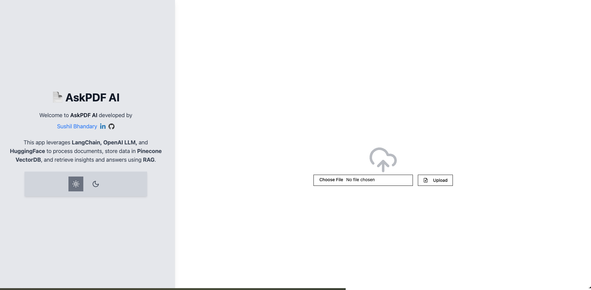
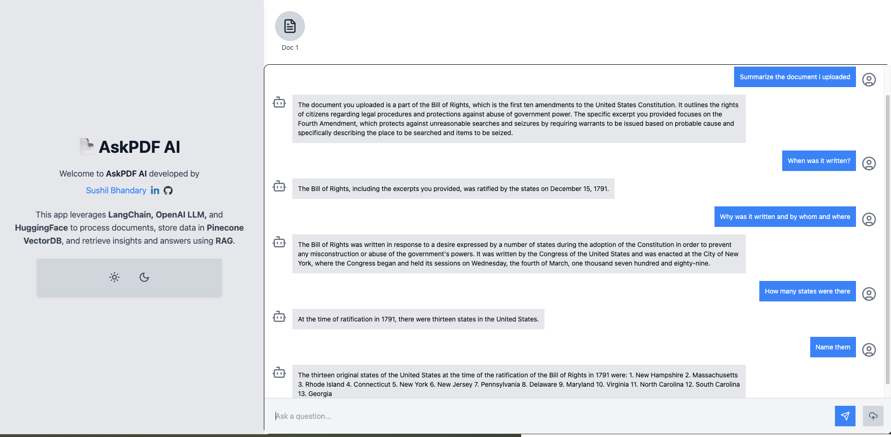

# AskPDF-AI Backend

AskPDF-AI is an advanced **Generative AI-powered** application designed to process PDF documents and provide accurate answers to questions based on the content within the PDFs. The backend is built using **FastAPI** and serves as the core processing unit for handling PDF uploads, text extraction, vector embeddings, and response generation.

This application is containerized using **Docker** and deployed using **AWS Fargate** with a fully automated **CI/CD pipeline**.

---

## **How It Works**


The **LangChain-based** backend follows these steps to provide responses to your questions:

1. **PDF Loading**: The app reads multiple PDF documents and extracts their text content.
2. **Text Chunking**: The extracted text is divided into smaller, manageable chunks.
3. **Vector Embeddings**: The application generates vector representations (embeddings) for the text chunks.
4. **Similarity Matching**: When you ask a question, the app compares it with the text chunks and identifies the most semantically similar ones.
5. **Response Generation**: The relevant text chunks are passed to a language model to generate an accurate response.

---

## **Backend Tech Stack**

The **backend** of AskPDF-AI is built with:

- **FastAPI** → A modern, high-performance web framework for Python.
- **LangChain** → Framework for building applications powered by large language models (LLMs).
- **FAISS** → A vector database for efficient similarity searches.
- **OpenAI API** → Used for embedding generation and language modeling.
- **PostgreSQL** → Database for storing user and document data.
- **Redis** → Caching system to optimize performance.

---

---

## Application UI

Below is a preview of the **AskPDF-AI** user interface:





---

## **🚀 Installation and Setup**

### 1️. Clone the Repository 
```sh
git clone https://github.com/sushilrajeeva/AskPDF-AI_Backend.git
cd AskPDF-AI_Backend
```


### 2. Create a Virtual Environment 
```sh
python -m venv venv
source venv/bin/activate  # On Windows use: venv\Scripts\activate
```


### 3. Install Dependencies 
```sh
pip install -r requirements.txt
```

### 4. Configure Environment Variables 
Create a .env file in the root directory and add:

```sh
OPENAI_API_KEY=your_openai_api_key
DATABASE_URL=your_postgresql_url
REDIS_URL=your_redis_url

```

### 5. Run the Backend Locally 
Create a .env file in the root directory and add:

```sh
uvicorn app.main:app --host 0.0.0.0 --port 8000 --reload

```
The backend will be available at: http://localhost:8000
API documentation can be accessed at: http://localhost:8000/docs


## 🐳 Docker Setup

This project is containerized using Docker for easy deployment.

### 1. Pull the Backend Docker Image

```sh
docker pull sushilrajeev/ask-pdf-backend:latest  
```

### 2. Run the Backend Container

```sh
docker run -p 8000:8000 --env-file .env sushilrajeev/ask-pdf-backend:latest

```
The backend will be accessible at: http://localhost:8000

## CI/CD Pipeline

I have implemented a fully automated CI/CD pipeline using GitHub Actions, DockerHub, and AWS Fargate

### 1. CI - Continuous Integration

- On each push to main, the frontend image is built and pushed to DockerHub.
- The previous image is deleted to save space.


### 2. CD - Continuous Deployment

- Once the image is uploaded, the deployment process is triggered.
- The latest Docker image is pulled and a new task is deployed on AWS Fargate.
- This ensures zero-downtime and automated scaling.


## Frontend Setup

For the frontend setup, please refer to the repository: 👉 AskPDF-AI Backend Repository (https://github.com/sushilrajeeva/askpdf-frontend)
This repository contains instructions on how to:

### 1. Set up React + Vite and install dependencies.

### 2. Deploy the frontend using Docker and AWS Fargate.

## 📜 License
-------
The AskPDF-AI Chat App is released under the [MIT License](https://opensource.org/licenses/MIT).